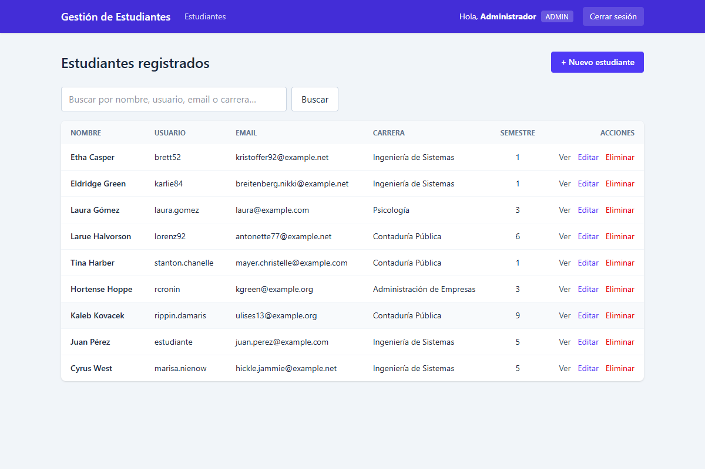
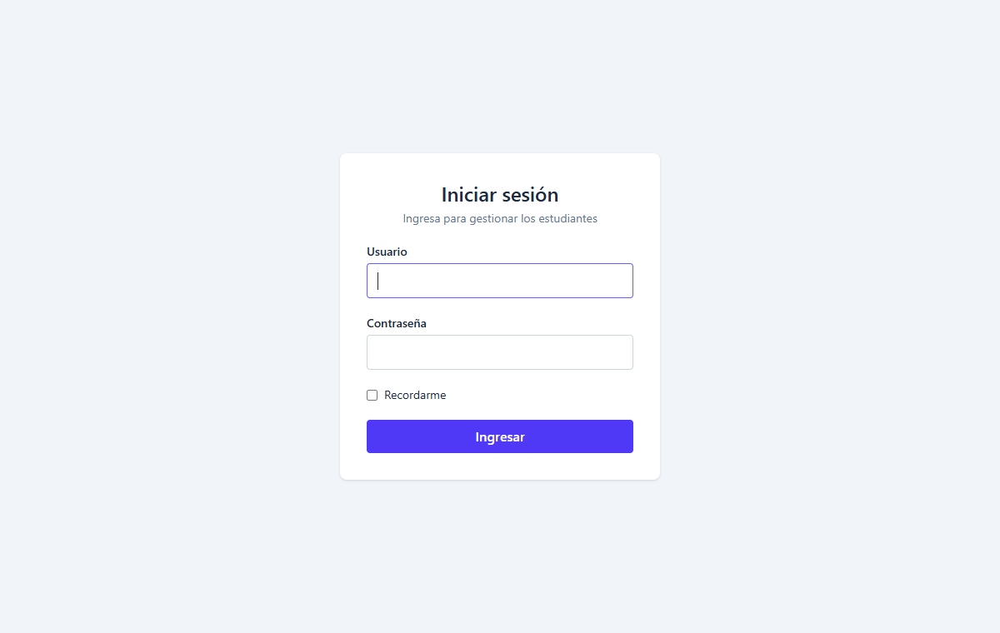
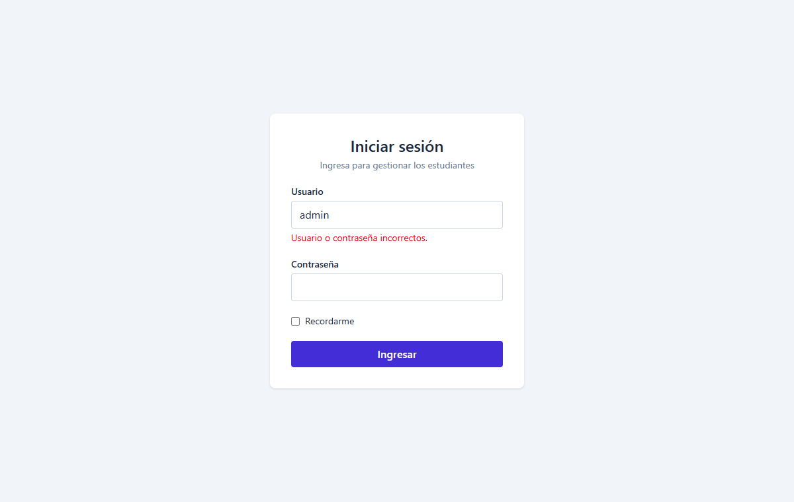
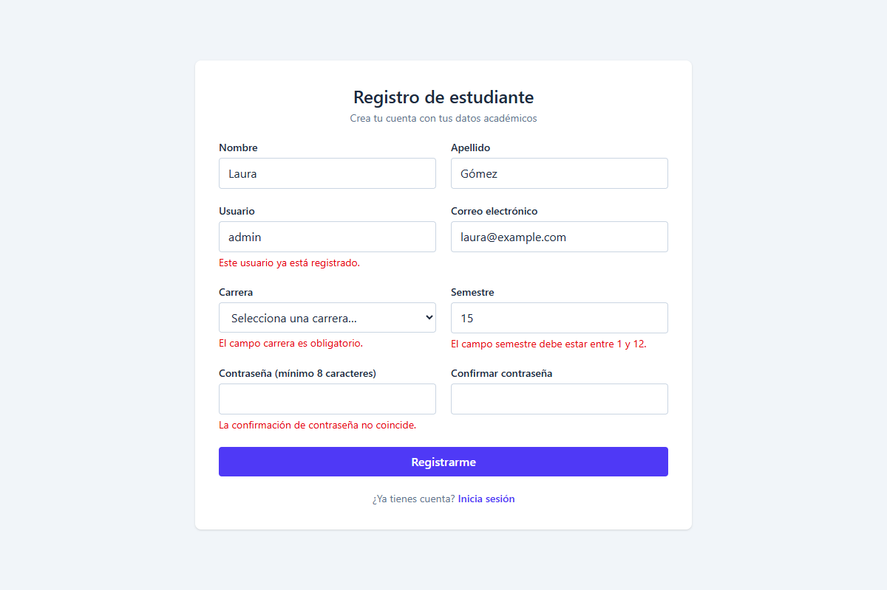
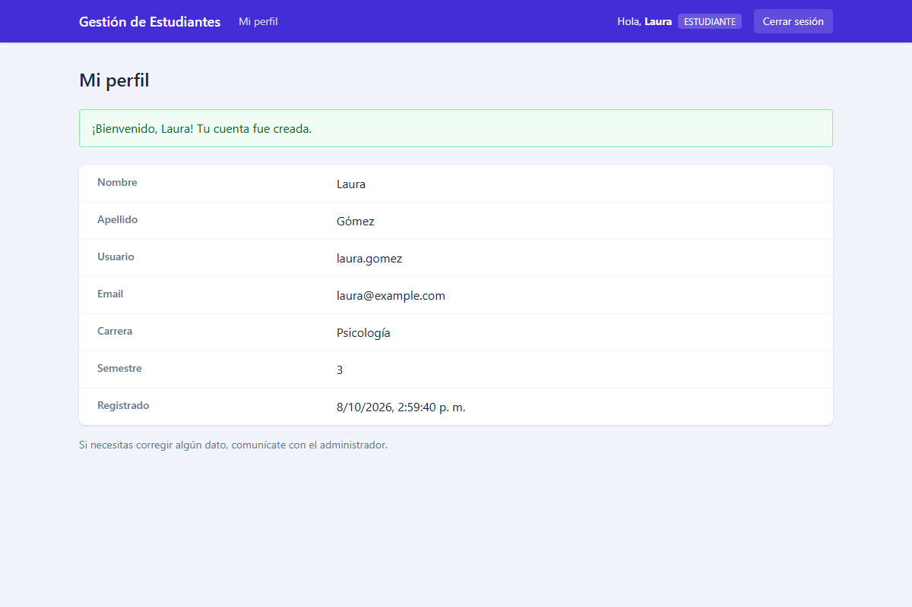
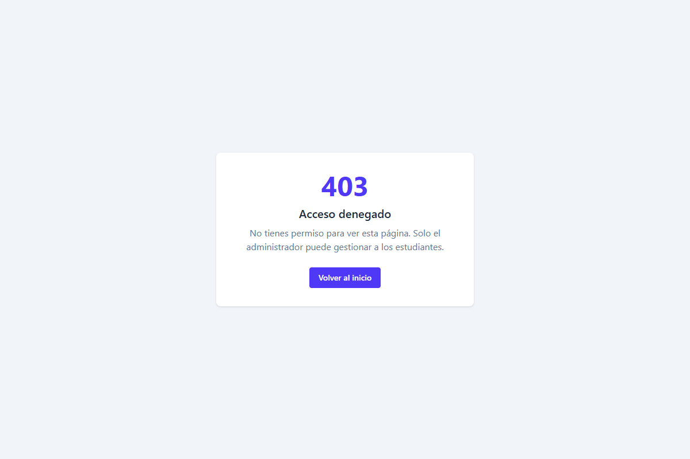
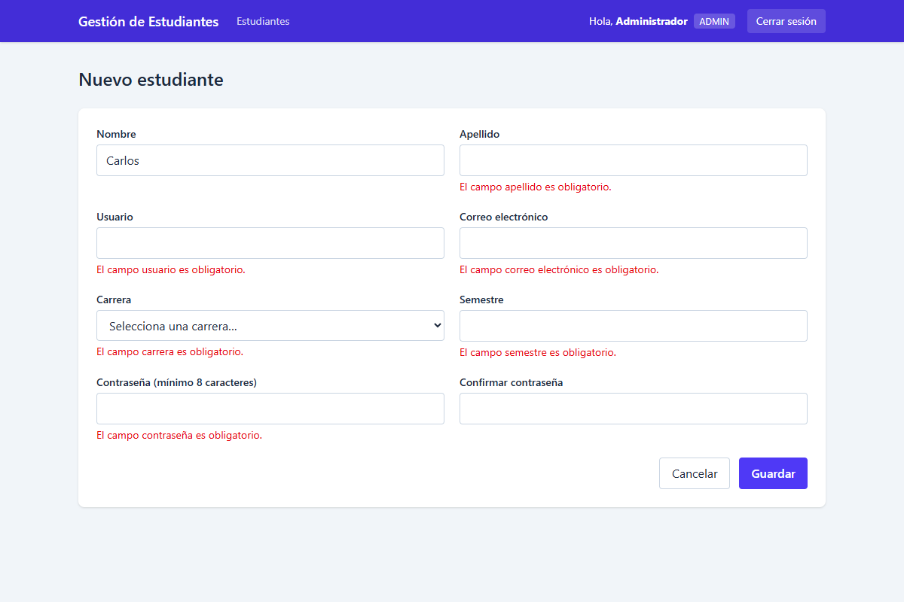
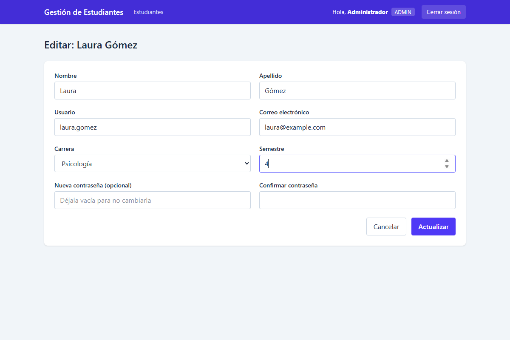
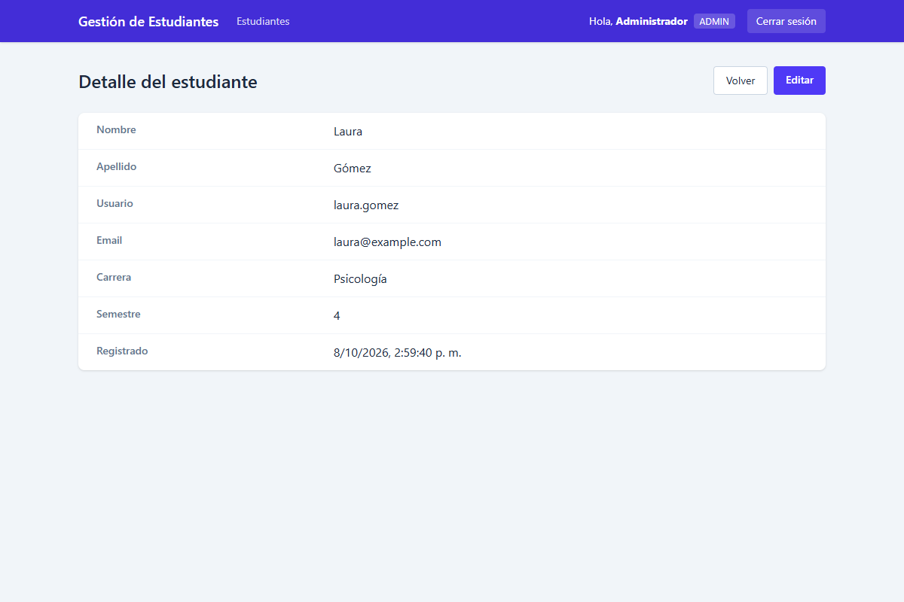
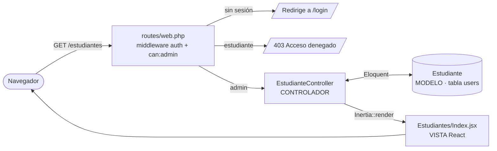

<h1 align="center">🎓 Gestión de Estudiantes</h1>

<p align="center">
  Aplicación web <strong>CRUD con Login</strong> construida con el patrón <strong>MVC</strong> usando <strong>Laravel + React</strong>.
</p>

<p align="center">
  
  
  
  
  
  
</p>

<p align="center">
  
</p>

---

## 📑 Índice

- [Descripción del proyecto](#-descripción-del-proyecto)
- [Estado del proyecto](#-estado-del-proyecto)
- [Funcionalidades y demostración](#-funcionalidades-y-demostración)
- [Arquitectura MVC](#-arquitectura-mvc)
- [Seguridad: login, rutas protegidas y cifrado](#-seguridad-login-rutas-protegidas-y-cifrado)
- [Acceso al proyecto (instalación)](#-acceso-al-proyecto)
- [Pruebas automáticas](#-pruebas-automáticas)
- [Tecnologías utilizadas](#-tecnologías-utilizadas)
- [Estructura de carpetas](#-estructura-de-carpetas)

---

## 📝 Descripción del proyecto

Sistema de **registro de estudiantes**:

- Cada **estudiante** crea su propia cuenta con sus datos académicos (nombre, apellido, usuario, correo, carrera y semestre) y, al iniciar sesión, ve **su perfil**.
- El **administrador** ve a **todos los estudiantes registrados** y puede **crearlos, consultarlos, editarlos y eliminarlos** (CRUD).

La sección de gestión está **protegida por un sistema de autenticación**. Si alguien intenta abrir cualquier URL protegida sin sesión, el servidor lo redirige al login. Si un estudiante intenta entrar al CRUD, el servidor responde **403 – Acceso denegado**.

El objetivo es aplicar en un mismo proyecto:

- El patrón de arquitectura **Modelo – Vista – Controlador (MVC)**.
- Las cuatro operaciones **CRUD**: Crear, Leer, Actualizar y Eliminar.
- **Autenticación** con contraseñas cifradas y protección de rutas.

## 🚦 Estado del proyecto

✅ **Terminado.** Cumple todos los requisitos de la actividad.

## ✨ Funcionalidades y demostración

🎥 **Video demostrativo:** [Ver en YouTube / Loom](https://ENLACE-DEL-VIDEO)

| Funcionalidad | Quién | Descripción |
|---|---|---|
| 📝 **Registro** | Visitante | Crea su cuenta de estudiante con validaciones (usuario y correo únicos, contraseña de mínimo 8 caracteres con confirmación) |
| 🔐 **Iniciar sesión** | Todos | Usuario y contraseña, opción "Recordarme". El admin llega al CRUD y el estudiante a su perfil |
| 👤 **Mi perfil** | Estudiante | Ve sus propios datos |
| 📋 **Listar y buscar** | Admin | Tabla de todos los estudiantes registrados, con búsqueda y paginación |
| ➕ **Crear** | Admin | Registra un estudiante con su usuario y contraseña |
| 👁️ **Ver detalle** | Admin | Ficha completa del estudiante |
| ✏️ **Editar** | Admin | Actualiza datos; la contraseña es opcional (vacía = no se cambia) |
| 🗑️ **Eliminar** | Admin | Borrado con confirmación previa |
| 🚫 **Rutas protegidas** | — | Sin sesión → `/login`. Estudiante en el CRUD → **403** |
| 🚪 **Cerrar sesión** | Todos | Invalida la sesión, limpia el historial del navegador y regresa al login |

### Capturas

| Login | Credenciales incorrectas |
|---|---|
|  |  |

| Registro con validaciones | Perfil del estudiante tras registrarse |
|---|---|
|  |  |

| Estudiante intenta entrar al CRUD (403) | Admin: estudiantes registrados (Leer) |
|---|---|
|  |  |

| Admin: crear con validaciones | Admin: editar (Actualizar) |
|---|---|
|  |  |

| Admin: detalle |
|---|
|  |

## 🏛️ Arquitectura MVC

Laravel y React se conectan con **[Inertia.js](https://inertiajs.com)**. Así todo vive en **un solo proyecto MVC**: el controlador de Laravel devuelve un componente React como si fuera una vista. No hace falta una API REST aparte ni tokens; se usan las rutas y la sesión de Laravel.



### Una sola tabla para usuarios y estudiantes

Los estudiantes **son** los usuarios del sistema: todo se guarda en la tabla `users`.

| Columna | Descripción |
|---|---|
| `nombre`, `apellido`, `username`, `email` | Datos personales y de acceso (`username` y `email` son únicos) |
| `carrera`, `semestre` | Datos académicos (vacíos para el admin) |
| `role` | `estudiante` (por defecto) o `admin` |
| `password` | Contraseña cifrada con bcrypt |

Dos modelos trabajan sobre esa misma tabla:

- **`User`**: cualquier persona que inicia sesión (admin o estudiante). Lo usa el login.
- **`Estudiante`** (`extends User`): aplica un *global scope* `where role = 'estudiante'`. Lo usa el CRUD, así que **el admin nunca aparece en el listado ni se puede editar o eliminar desde ahí**, y todo lo que se crea con este modelo queda con rol estudiante.

```php
// app/Models/Estudiante.php
class Estudiante extends User
{
    protected $table = 'users';

    protected static function booted(): void
    {
        static::addGlobalScope('estudiantes', fn (Builder $query) => $query->where('role', self::ROLE_ESTUDIANTE));
        static::creating(fn (Estudiante $estudiante) => $estudiante->role = self::ROLE_ESTUDIANTE);
    }
}
```

| Capa | Archivos |
|---|---|
| **Modelo** | [`app/Models/User.php`](app/Models/User.php), [`app/Models/Estudiante.php`](app/Models/Estudiante.php), migración en [`database/migrations/`](database/migrations/) |
| **Vista** | [`resources/js/Pages/`](resources/js/Pages/): `Auth/Login.jsx`, `Auth/Register.jsx`, `Perfil.jsx`, `Estudiantes/{Index,Create,Edit,Show,Form}.jsx`, `Error.jsx`; componentes en [`resources/js/Components/`](resources/js/Components/) |
| **Controlador** | [`EstudianteController.php`](app/Http/Controllers/EstudianteController.php) (CRUD), [`AuthController.php`](app/Http/Controllers/AuthController.php) (registro, login y logout), [`PerfilController.php`](app/Http/Controllers/PerfilController.php) (inicio y perfil) |
| **Validación** | [`app/Http/Requests/EstudianteRequest.php`](app/Http/Requests/EstudianteRequest.php), compartida por el registro y el CRUD |
| **Rutas** | [`routes/web.php`](routes/web.php) |

### Rutas

| Operación | Método | URL | Acción | Quién puede |
|---|---|---|---|---|
| Iniciar sesión | `GET` / `POST` | `/login` | `showLogin` / `login` | Visitante |
| Registrarse | `GET` / `POST` | `/register` | `showRegister` / `register` | Visitante |
| Inicio (redirige según el rol) | `GET` | `/` | `inicio` | Con sesión |
| Mi perfil | `GET` | `/perfil` | `show` | Con sesión |
| Leer (listado) | `GET` | `/estudiantes` | `index` | Admin |
| Leer (detalle) | `GET` | `/estudiantes/{id}` | `show` | Admin |
| Crear | `GET` + `POST` | `/estudiantes/create` + `/estudiantes` | `create` / `store` | Admin |
| Actualizar | `GET` + `PUT` | `/estudiantes/{id}/edit` + `/estudiantes/{id}` | `edit` / `update` | Admin |
| Eliminar | `DELETE` | `/estudiantes/{id}` | `destroy` | Admin |

## 🔒 Seguridad: login, rutas protegidas y cifrado

### Rutas protegidas

```php
// routes/web.php
Route::middleware(['auth', 'inertia.encrypt'])->group(function () {
    Route::get('/', [PerfilController::class, 'inicio'])->name('inicio');
    Route::post('/logout', [AuthController::class, 'logout'])->name('logout');

    // Cualquier usuario autenticado: ver sus propios datos
    Route::get('/perfil', [PerfilController::class, 'show'])->name('perfil');

    // Solo el administrador: CRUD de todos los estudiantes (otro usuario recibe 403)
    Route::resource('estudiantes', EstudianteController::class)->middleware('can:admin');
});
```

- **`auth`** se ejecuta **en el servidor**. Si no hay sesión, Laravel redirige a `/login` antes de llegar al controlador. Por eso escribir la URL a mano en el navegador tampoco funciona.
- **`can:admin`** usa un *Gate* definido en [`AppServiceProvider.php`](app/Providers/AppServiceProvider.php) (`Gate::define('admin', fn (User $user) => $user->isAdmin())`). Si un estudiante escribe `/estudiantes` a mano, el servidor responde **403** con una página de "Acceso denegado".
- **`guest`** protege `/login` y `/register`: un usuario ya autenticado es enviado a su página de inicio.
- Al **cerrar sesión** se limpia el historial del navegador (`inertia.encrypt` + `Inertia::clearHistory()`), así que el botón "Atrás" tampoco muestra datos protegidos.
- El campo `role` **no está en `$fillable`**: nadie puede registrarse como administrador enviando `role=admin` en el formulario.

### Cifrado de contraseñas

Las contraseñas **nunca se guardan en texto plano**. Se cifran con **bcrypt**, el algoritmo de *hashing* que Laravel usa por defecto:

```php
// app/Models/User.php
protected function casts(): array
{
    return ['password' => 'hashed'];   // cifra automáticamente al guardar
}
```

Así se ven en la base de datos. Los hashes cambian en cada instalación por el *salt* aleatorio:

```text
$ php artisan usuarios:listar
+----+------------+------------+--------------------------------------------------------------+
| ID | Usuario    | Rol        | Contraseña almacenada (hash)                                 |
+----+------------+------------+--------------------------------------------------------------+
| 1  | admin      | admin      | $2y$10$gOdlEbhTvQ62i3pReTXjGu8.1HpckIffzjxX82RJ/ra32fitZQiTC |
| 2  | estudiante | estudiante | $2y$10$MbZpRrNOkju5KTDA2DAOg.y5/5VPuOtcM4COs.3SdvkYmER8dEPoq |
+----+------------+------------+--------------------------------------------------------------+
```

> **¿Por qué bcrypt y no md5?** md5 se diseñó para ser rápido, por lo que hoy se pueden probar miles de millones de contraseñas por segundo. Además, sin *salt*, la misma contraseña siempre produce el mismo hash y se puede buscar en tablas precalculadas. **bcrypt** es lento a propósito (factor de costo `10`, el `$10$` del hash: 2¹⁰ = 1024 rondas, configurable con `BCRYPT_ROUNDS` en el `.env`) y añade un *salt* aleatorio a cada contraseña, así que dos usuarios con la misma clave tienen hashes distintos.

Al iniciar sesión, `Auth::attempt()` cifra la contraseña escrita y la compara con el hash guardado:

```php
// app/Http/Controllers/AuthController.php
if (! Auth::attempt($credentials, $request->boolean('remember'))) {
    throw ValidationException::withMessages(['username' => 'Usuario o contraseña incorrectos.']);
}
$request->session()->regenerate();
```

### Otras medidas

- 🔁 **Regeneración de sesión** al iniciar sesión, contra la fijación de sesión.
- 🛡️ **Protección CSRF** en todos los formularios.
- ⏱️ **Límite de intentos**: máximo 5 intentos de login o registro por minuto (`throttle:5,1`).
- ✅ **Validación en el servidor** de todos los datos.

## 🚀 Acceso al proyecto

### Requisitos

- PHP 8.3 o superior, con las extensiones `pdo_sqlite`, `mbstring`, `openssl`, `fileinfo`
- [Composer](https://getcomposer.org/)
- [Node.js](https://nodejs.org/) 20 o superior y npm

### Instalación

```bash
# 1. Clonar el repositorio
git clone https://github.com/Miguel14011/Login_Crud_Estudiantes.git
cd Login_Crud_Estudiantes

# 2. Instalar dependencias
composer install
npm install

# 3. Configurar el entorno
cp .env.example .env
php artisan key:generate

# 4. Crear la base de datos (SQLite) con datos de ejemplo
touch database/database.sqlite        # en Windows: type nul > database\database.sqlite
php artisan migrate --seed

# 5. Compilar el frontend y levantar el servidor
npm run build
php artisan serve
```

Abre **http://127.0.0.1:8000** e ingresa con:

| Usuario | Contraseña | Rol |
|---|---|---|
| `admin` | `admin123` | Administrador |
| `estudiante` | `estudiante123` | Estudiante |

O crea tu propia cuenta de estudiante desde **Regístrate** en la pantalla de login (`/register`).

> 💡 Mientras desarrollas, usa `npm run dev` en otra terminal para ver los cambios de React al instante.

### Comandos útiles

| Comando | Descripción |
|---|---|
| `php artisan usuarios:listar` | Muestra los usuarios con su rol y su contraseña cifrada |
| `php artisan migrate:fresh --seed` | ⚠️ **Borra todo** y deja solo los datos de ejemplo |

## 🧪 Pruebas automáticas

```bash
php artisan test
```

24 pruebas en [`tests/Feature/`](tests/Feature/) verifican que:

- Cada URL protegida **redirige a `/login` sin sesión**.
- La contraseña se guarda **cifrada con bcrypt**.
- El login acepta credenciales válidas y rechaza las incorrectas; el admin llega al CRUD y el estudiante a su perfil.
- El registro crea un **estudiante** con la contraseña cifrada, no permite registrarse como admin, y el estudiante aparece en el listado del admin.
- Un estudiante recibe **403** en todas las rutas del CRUD y solo ve su propio perfil.
- El admin puede crear, ver, editar (con o sin cambiar la contraseña) y eliminar estudiantes, pero no puede editarse ni eliminarse a sí mismo desde el CRUD.

## 🛠️ Tecnologías utilizadas

| Tecnología | Uso |
|---|---|
| [Laravel 13](https://laravel.com) | Backend: rutas, controladores, modelos (Eloquent), autenticación, autorización y validación |
| [React 19](https://react.dev) | Interfaz de usuario (capa Vista) |
| [Inertia.js](https://inertiajs.com) | Conecta los controladores de Laravel con los componentes React |
| [Tailwind CSS 4](https://tailwindcss.com) | Estilos |
| [Vite](https://vitejs.dev) | Compilación del frontend |
| SQLite | Base de datos |
| PHPUnit | Pruebas automáticas |

## 📂 Estructura de carpetas

```text
Login_Crud_Estudiantes/
├── app/
│   ├── Http/
│   │   ├── Controllers/
│   │   │   ├── AuthController.php         # Registro / login / logout
│   │   │   ├── EstudianteController.php   # CRUD (solo admin)
│   │   │   └── PerfilController.php       # Inicio según el rol y "Mi perfil"
│   │   ├── Middleware/
│   │   │   └── HandleInertiaRequests.php  # Datos compartidos con React (usuario, rol, mensajes)
│   │   └── Requests/
│   │       └── EstudianteRequest.php      # Validación del registro y del CRUD
│   ├── Models/
│   │   ├── User.php                       # Tabla users: admin y estudiantes
│   │   └── Estudiante.php                 # Misma tabla, filtrada a role = estudiante
│   └── Providers/AppServiceProvider.php   # Permiso (Gate) 'admin'
├── database/
│   ├── factories/                         # Datos de prueba
│   ├── migrations/                        # Estructura de las tablas
│   └── seeders/DatabaseSeeder.php         # admin, estudiante de prueba y 7 de ejemplo
├── resources/
│   ├── js/
│   │   ├── app.jsx                        # Punto de entrada de React
│   │   ├── Components/                    # CamposEstudiante, FichaEstudiante
│   │   ├── Layouts/AppLayout.jsx
│   │   └── Pages/
│   │       ├── Auth/{Login,Register}.jsx
│   │       ├── Estudiantes/{Index,Create,Edit,Show,Form}.jsx
│   │       ├── Perfil.jsx
│   │       └── Error.jsx                  # Páginas 403 / 404
│   └── views/app.blade.php                # Plantilla HTML raíz
├── routes/
│   ├── web.php                            # Rutas públicas y protegidas
│   └── console.php                        # Comando usuarios:listar
└── tests/Feature/                         # Pruebas de login, registro, roles y CRUD
```
