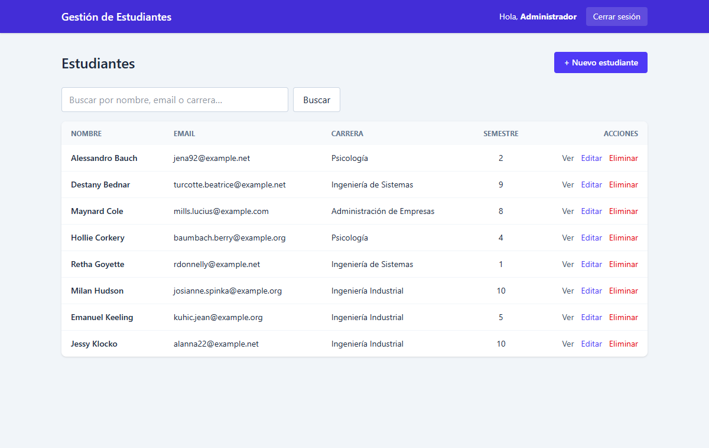
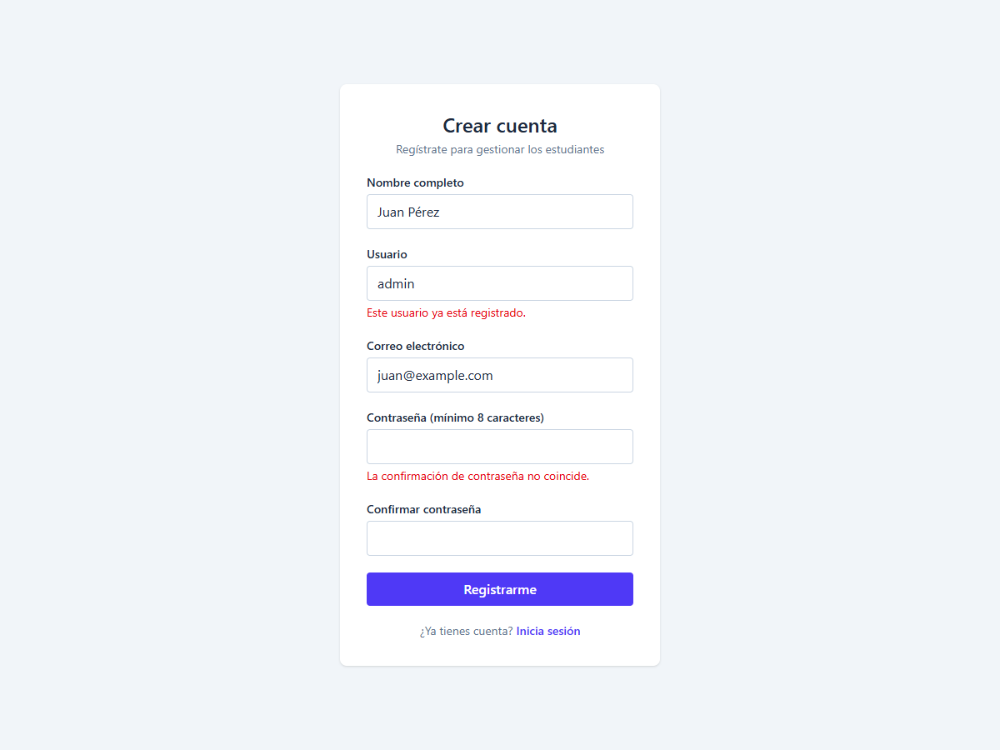
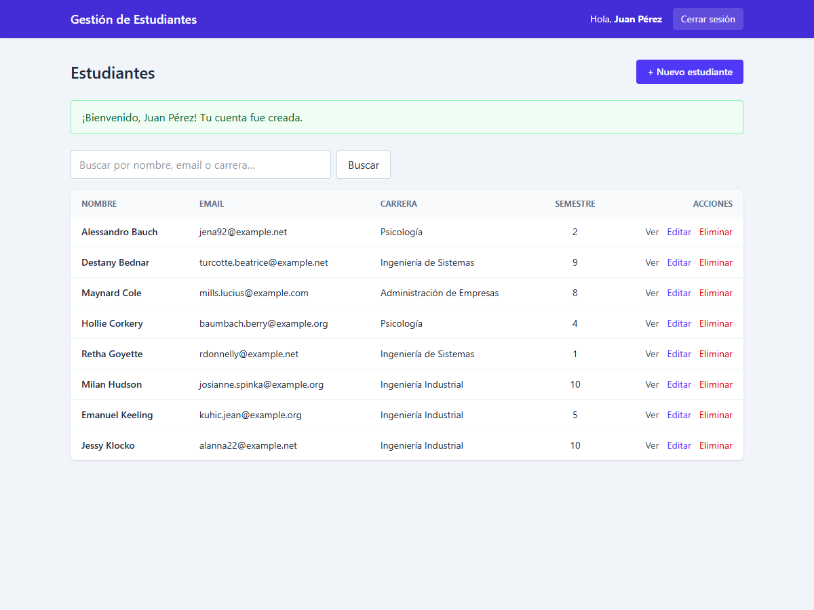
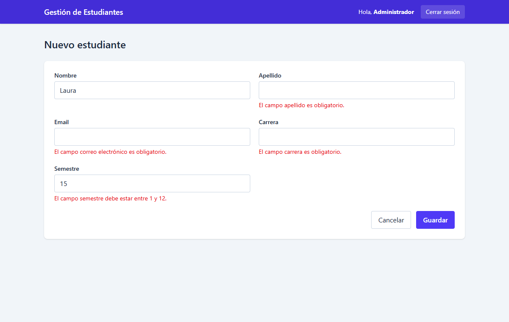
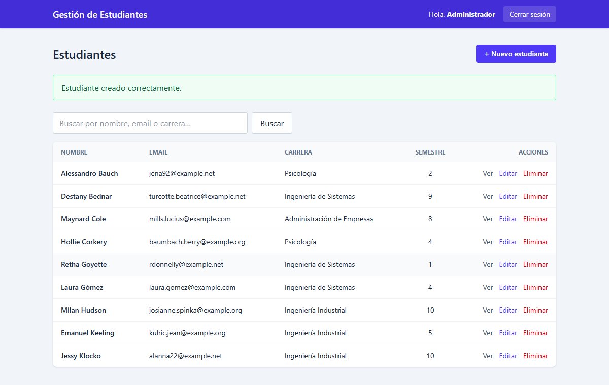
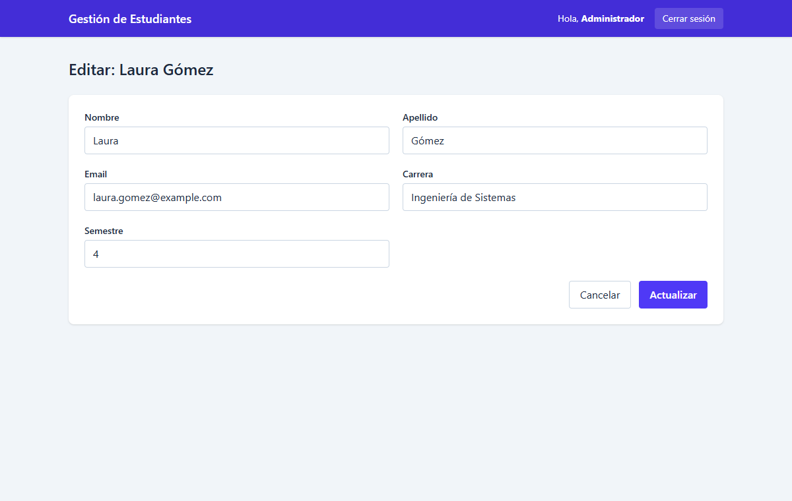
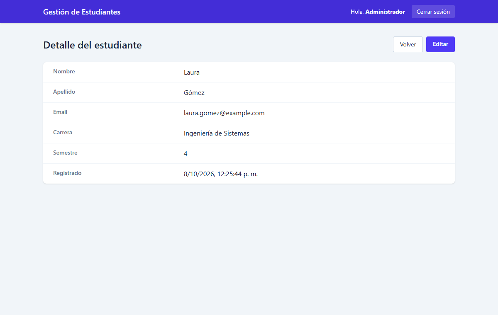
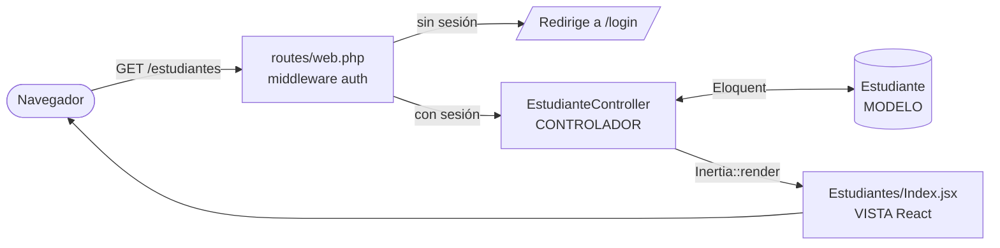

<h1 align="center">🎓 Gestión de Estudiantes</h1>

<p align="center">
  Aplicación web <strong>CRUD con Login</strong> construida con el patrón <strong>MVC</strong> usando <strong>Laravel + React</strong>.
</p>

<p align="center">
  
  
  
  
  
  
  
</p>

<p align="center">
  
</p>

---

## 📑 Índice

- [Descripción del proyecto](#-descripción-del-proyecto)
- [Estado del proyecto](#-estado-del-proyecto)
- [Funcionalidades y demostración](#-funcionalidades-y-demostración)
- [Arquitectura MVC](#-arquitectura-mvc)
- [Seguridad: login, rutas protegidas y cifrado](#-seguridad-login-rutas-protegidas-y-cifrado)
- [Acceso al proyecto (instalación)](#-acceso-al-proyecto)
- [Pruebas automáticas](#-pruebas-automáticas)
- [Tecnologías utilizadas](#-tecnologías-utilizadas)
- [Estructura de carpetas](#-estructura-de-carpetas)
- [Persona desarrolladora](#-persona-desarrolladora)
- [Licencia](#-licencia)

---

## 📝 Descripción del proyecto

Aplicación para **registrar, consultar, editar y eliminar estudiantes** (nombre, apellido, correo, carrera y semestre).

La sección de gestión está **protegida por un sistema de autenticación**. Solo puede entrar quien inicie sesión con usuario y contraseña. Si alguien intenta abrir cualquier URL del CRUD sin sesión, el servidor lo redirige al login.

El objetivo es aplicar en un mismo proyecto:

- El patrón de arquitectura **Modelo – Vista – Controlador (MVC)**.
- Las cuatro operaciones **CRUD**: Crear, Leer, Actualizar y Eliminar.
- **Autenticación** con contraseñas cifradas y protección de rutas.

## 🚦 Estado del proyecto

✅ **Terminado.** Cumple todos los requisitos de la actividad.

## ✨ Funcionalidades y demostración

🎥 **Video demostrativo:** [Ver en YouTube / Loom](https://ENLACE-DEL-VIDEO)

| Funcionalidad | Descripción |
|---|---|
| 📝 **Registro** | Cualquier persona puede crear su cuenta (nombre, usuario, correo y contraseña con confirmación) |
| 🔐 **Iniciar sesión** | Acceso con usuario y contraseña, opción "Recordarme" |
| 🚫 **Rutas protegidas** | Sin sesión, cualquier URL del CRUD redirige a `/login` |
| 📋 **Listar** | Tabla con búsqueda por nombre, correo o carrera, y paginación |
| ➕ **Crear** | Formulario con validaciones (campos obligatorios, correo único, semestre 1-12) |
| 👁️ **Ver detalle** | Ficha completa del estudiante |
| ✏️ **Editar** | Actualización de datos con las mismas validaciones |
| 🗑️ **Eliminar** | Borrado con confirmación previa |
| 🚪 **Cerrar sesión** | Invalida la sesión y regresa al login |

### Capturas

| Login | Credenciales incorrectas |
|---|---|
|  |  |

| Registro con validaciones | Registro exitoso (inicia sesión automáticamente) |
|---|---|
|  |  |

| Listado (Leer) | Crear con validaciones |
|---|---|
|  |  |

| Registro creado | Editar (Actualizar) |
|---|---|
|  |  |

| Detalle |
|---|
|  |

## 🏛️ Arquitectura MVC

Laravel y React se conectan con **[Inertia.js](https://inertiajs.com)**. Así todo vive en **un solo proyecto MVC**: el controlador de Laravel devuelve un componente React como si fuera una vista. No hace falta una API REST aparte ni tokens; se usan las rutas y la sesión de Laravel.



| Capa | Archivos |
|---|---|
| **Modelo** | [`app/Models/Estudiante.php`](app/Models/Estudiante.php), [`app/Models/User.php`](app/Models/User.php), migraciones en [`database/migrations/`](database/migrations/) |
| **Vista** | [`resources/js/Pages/`](resources/js/Pages/): `Auth/Login.jsx`, `Auth/Register.jsx`, `Estudiantes/Index.jsx`, `Create.jsx`, `Edit.jsx`, `Show.jsx`, `Form.jsx`; layout en [`resources/js/Layouts/AppLayout.jsx`](resources/js/Layouts/AppLayout.jsx) |
| **Controlador** | [`EstudianteController.php`](app/Http/Controllers/EstudianteController.php) (CRUD) y [`AuthController.php`](app/Http/Controllers/AuthController.php) (registro, login y logout) |
| **Rutas** | [`routes/web.php`](routes/web.php) |

### Rutas públicas (solo sin sesión)

| Método | URL | Acción |
|---|---|---|
| `GET` / `POST` | `/login` | `showLogin` / `login` |
| `GET` / `POST` | `/register` | `showRegister` / `register` |

### Rutas del CRUD (requieren sesión)

| Operación | Método | URL | Acción |
|---|---|---|---|
| Leer (listado) | `GET` | `/estudiantes` | `index` |
| Crear (formulario) | `GET` | `/estudiantes/create` | `create` |
| Crear (guardar) | `POST` | `/estudiantes` | `store` |
| Leer (detalle) | `GET` | `/estudiantes/{id}` | `show` |
| Actualizar (formulario) | `GET` | `/estudiantes/{id}/edit` | `edit` |
| Actualizar (guardar) | `PUT` | `/estudiantes/{id}` | `update` |
| Eliminar | `DELETE` | `/estudiantes/{id}` | `destroy` |

## 🔒 Seguridad: login, rutas protegidas y cifrado

### Rutas protegidas

```php
// routes/web.php
Route::middleware('auth')->group(function () {
    Route::post('/logout', [AuthController::class, 'logout'])->name('logout');
    Route::resource('estudiantes', EstudianteController::class);
});
```

El middleware `auth` se ejecuta **en el servidor**. Si no hay sesión, Laravel responde con una redirección a `/login` antes de llegar al controlador. Por eso escribir la URL a mano en el navegador tampoco funciona. Además, las rutas `/login` y `/register` usan el middleware `guest`: un usuario ya autenticado es enviado directamente al CRUD.

### Cifrado de contraseñas

Las contraseñas **nunca se guardan en texto plano**. Se cifran con **bcrypt**, el algoritmo de *hashing* que Laravel usa por defecto:

```php
// app/Models/User.php
protected function casts(): array
{
    return ['password' => 'hashed'];   // cifra automáticamente al guardar
}
```

Así se ve la contraseña `admin123` en la base de datos. El hash cambia en cada instalación por el *salt* aleatorio:

```text
$ php artisan usuarios:listar
+----+---------+--------------------------------------------------------------+
| ID | Usuario | Contraseña almacenada (hash)                                 |
+----+---------+--------------------------------------------------------------+
| 1  | admin   | $2y$12$th6s5ZH2GcZ58dz5U8/wzuMD4cTrn23X3AyDdy37omVP0/ugclqJ6 |
+----+---------+--------------------------------------------------------------+
```

> **¿Por qué bcrypt y no md5?** md5 se diseñó para ser rápido, por lo que hoy se pueden probar miles de millones de contraseñas por segundo. Además, sin *salt*, la misma contraseña siempre produce el mismo hash y se puede buscar en tablas precalculadas. **bcrypt** es lento a propósito (factor de costo `12`, el `$12$` del hash) y añade un *salt* aleatorio a cada contraseña, así que dos usuarios con la misma clave tienen hashes distintos.

Al iniciar sesión, `Auth::attempt()` cifra la contraseña escrita y la compara con el hash guardado:

```php
// app/Http/Controllers/AuthController.php
if (! Auth::attempt($credentials, $request->boolean('remember'))) {
    throw ValidationException::withMessages(['username' => 'Usuario o contraseña incorrectos.']);
}
$request->session()->regenerate();
```

### Otras medidas

- 🔁 **Regeneración de sesión** al iniciar sesión, contra la fijación de sesión.
- 🛡️ **Protección CSRF** en todos los formularios.
- ⏱️ **Límite de intentos**: máximo 5 intentos de login por minuto (`throttle:5,1`).
- ✅ **Validación en el servidor** de todos los datos del CRUD.

## 🚀 Acceso al proyecto

### Requisitos

- PHP 8.3 o superior, con las extensiones `pdo_sqlite`, `mbstring`, `openssl`, `fileinfo`
- [Composer](https://getcomposer.org/)
- [Node.js](https://nodejs.org/) 20 o superior y npm

### Instalación

```bash
# 1. Clonar el repositorio
git clone https://github.com/TU_USUARIO/crud-estudiantes.git
cd crud-estudiantes

# 2. Instalar dependencias
composer install
npm install

# 3. Configurar el entorno
cp .env.example .env
php artisan key:generate

# 4. Crear la base de datos (SQLite) con datos de ejemplo
touch database/database.sqlite        # en Windows: type nul > database\database.sqlite
php artisan migrate --seed

# 5. Compilar el frontend y levantar el servidor
npm run build
php artisan serve
```

Abre **http://127.0.0.1:8000** e ingresa con:

| Usuario | Contraseña |
|---|---|
| `admin` | `admin123` |

O crea tu propia cuenta desde **Regístrate** en la pantalla de login (`/register`).

> 💡 Mientras desarrollas, usa `npm run dev` en otra terminal para ver los cambios de React al instante.

### Comandos útiles

| Comando | Descripción |
|---|---|
| `php artisan usuarios:listar` | Muestra los usuarios y su contraseña cifrada |
| `php artisan usuarios:crear juan clave123` | Crea un nuevo usuario para iniciar sesión |
| `php artisan migrate:fresh --seed` | Reinicia la base de datos con los datos de ejemplo |

## 🧪 Pruebas automáticas

```bash
php artisan test
```

16 pruebas en [`tests/Feature/`](tests/Feature/) verifican que:

- Cada URL protegida (`index`, `create`, `show`, `edit`, `store`, `update`, `destroy`) **redirige a `/login` sin sesión**.
- La contraseña se guarda **cifrada con bcrypt**.
- El login acepta credenciales válidas y rechaza las incorrectas.
- Un usuario autenticado no ve el login y puede cerrar sesión.
- El registro crea el usuario con la contraseña cifrada, inicia sesión y valida usuario y correo únicos y la confirmación de contraseña.
- Funcionan las operaciones CRUD y sus validaciones.

## 🛠️ Tecnologías utilizadas

| Tecnología | Uso |
|---|---|
| [Laravel 13](https://laravel.com) | Backend: rutas, controladores, modelos (Eloquent), autenticación y validación |
| [React 19](https://react.dev) | Interfaz de usuario (capa Vista) |
| [Inertia.js](https://inertiajs.com) | Conecta los controladores de Laravel con los componentes React |
| [Tailwind CSS 4](https://tailwindcss.com) | Estilos |
| [Vite](https://vitejs.dev) | Compilación del frontend |
| SQLite | Base de datos |
| PHPUnit | Pruebas automáticas |

## 📂 Estructura de carpetas

```text
crud-estudiantes/
├── app/
│   ├── Http/
│   │   ├── Controllers/
│   │   │   ├── AuthController.php         # Registro / login / logout
│   │   │   └── EstudianteController.php   # CRUD
│   │   └── Middleware/
│   │       └── HandleInertiaRequests.php  # Datos compartidos con React (usuario, mensajes)
│   └── Models/
│       ├── Estudiante.php
│       └── User.php
├── database/
│   ├── factories/                         # Datos de prueba
│   ├── migrations/                        # Estructura de las tablas
│   └── seeders/DatabaseSeeder.php         # Usuario admin + estudiantes de ejemplo
├── resources/
│   ├── js/
│   │   ├── app.jsx                        # Punto de entrada de React
│   │   ├── Layouts/AppLayout.jsx
│   │   └── Pages/
│   │       ├── Auth/{Login,Register}.jsx
│   │       └── Estudiantes/{Index,Create,Edit,Show,Form}.jsx
│   └── views/app.blade.php                # Plantilla HTML raíz
├── routes/
│   ├── web.php                            # Rutas públicas y protegidas
│   └── console.php                        # Comandos usuarios:listar / usuarios:crear
└── tests/Feature/                         # Pruebas de login, protección y CRUD
```

## 👤 Persona desarrolladora

| [<br><sub><b>TU_NOMBRE</b></sub>](https://github.com/TU_USUARIO) |
| :---: |

## 📄 Licencia

Este proyecto se distribuye bajo la licencia [MIT](LICENSE).
